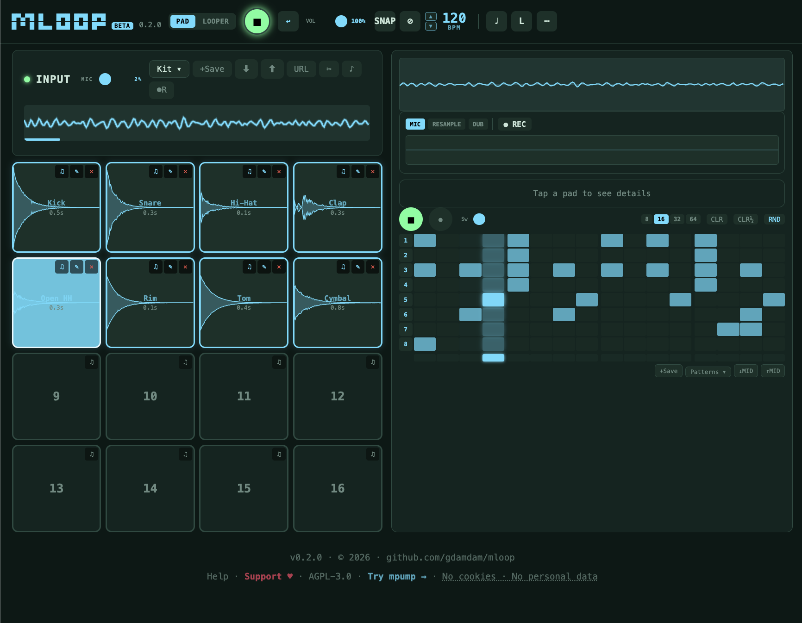

<h1 align="center">mloop</h1>

  Live sampler and loop station in your browser. 
  Record, layer, pad, sequence, destroy — no install, no subscription, no account.

  
  
  
    
  <strong><a href="https://mloop.mpump.live/">mloop.mpump.live</a></strong>

  

---

## Three Modes

| Mode | What it does |
|---|---|
| **PAD** | 4×4 MPC-style sample pads · step sequencer (8/16/32/64 steps) with real-time step recording · sample slicer · chromatic mode · resample from looper · 7 built-in drum kits · keyboard finger drumming |
| **LOOPER** | 3 independent loop tracks · record / overdub / undo / reverse / half-speed · KAOS XY pad with 10 live effects · destruction mode · tape reel UI |
| **MIXER** | Pro master-bus chain applied to everything: highpass rumble cut · 3-band EQ · glue compression · drive (soft-clip) · brick-wall limiter with adjustable ceiling · output trim · live clip LED |

PAD and LOOPER share the same session — save, pin, and export both at once. MIXER settings apply globally to the master bus.

---

## Loop Station (LOOPER mode)

- **Record / Overdub / Play / Stop** per track — layers accumulate non-destructively
- **Undo** last overdub layer per track
- **Reverse** and **half-speed** playback
- **3 sync modes** — FREE (freeform), SYNC (phase-locked), LOCK (fixed time window, default)
- **Metronome** with tap tempo
- **KAOS XY pad** — 10 effects mapped to X/Y axes with gesture recording and replay
- **10 effects** — delay (sync/free), reverb (room/hall/plate/spring), distortion, chorus, flanger, phaser, bitcrush, compressor, duck, tremolo (plus LPF and HPF hidden behind the XY pad)
- **Destruction mode** — progressive tape degradation (pitch drift, wow & flutter, bit reduction) per cycle
- **Master record** — capture full output as WAV with live timer
- **Tape reel animation** — spinning reels with color-coded record/play/stop states
- **Analog needle VU meter** — input (idle), output (playing), red zone (recording)
- **Audio input selector** — choose mic or line-in device
- **Low-signal detection** with auto-gain suggestion

## PAD Mode

- **16 pads** — each with sample, trim, pitch, pan, volume, play mode (one-shot / gate / loop)
- **Step sequencer** — 8 / 16 / 32 / 64 steps, swing, real-time step record, mute groups
- **7 built-in kits** — acoustic, lo-fi, electronic, percussion, and more
- **Sample capture** — record live from mic, resample from looper output, or import a file
- **Sample slicer** — auto-chop a loop into pads
- **Chromatic mode** — play pads as a pitched instrument
- **Sound Browser** — audition and load single samples

## Master Mixer (MIXER mode)

Pro-style master bus chain applied globally to PAD hits, loops, and resamples alike.

**Signal flow**: `masterGain → HPF → 3-band EQ → glue comp → drive → limiter → output trim → out`

- **HPF** — highpass rumble cut cycling OFF / 20 / 30 / 40 Hz
- **3-band EQ** — LOW (lowshelf @ 250 Hz), MID (peaking @ 1 kHz Q=1), HIGH (highshelf @ 4 kHz); ±18 dB each, centre tick at 0
- **Glue compressor** — gentle 2:1 bus compression with a single AMOUNT knob (0..1 maps to threshold 0→−18 dB) and automatic makeup gain
- **Drive** — tanh soft-clip waveshaper (1×–10×) with 2× oversampling and auto loudness compensation
- **Limiter** — brick-wall compressor with ON/OFF toggle, adjustable output CEILING (−6 to 0 dB, default −1 dB), and a live CLIP LED that lights red on ±0.98 peaks with a 120 ms hold
- **Output trim** — final user-facing VOL fader, post-limiter. The header VOL slider and the mixer VOL strip are the same control.

## Sessions

- **Named sessions** — save and load any number of named sessions (stored in browser IndexedDB)
- **Session thumbnails** — each saved session shows a visual preview: looper track bars (height = layer count), pad grid (filled = slot loaded), BPM, sync mode
- **Pin session** — auto-restore the pinned session on next open (looper + PAD together)
- **JSON export / import** — portable `.mloop-session.json` files, human-readable
- **WAV mixdown export** — mix all looper tracks to a stereo WAV

## Keyboard Shortcuts

| Key | Action |
|---|---|
| `⌘/Ctrl+Z` | Undo last overdub |
| `⌘/Ctrl+S` | Save session |

---

## Tech Stack

| Layer | Detail |
|---|---|
| Framework | React 19 + Vite 8 + TypeScript (strict) |
| Audio | Web Audio API — `AudioEngine`, `PadEngine`, `EffectsChain`, `DestructionEngine`, `TimingEngine` |
| State | `useReducer` + optimistic dispatch (`loopEngineReducer`, `loopEngineCommands`) |
| Persistence | IndexedDB (`SessionData`) + JSON export (`SessionExport`) — two independent surfaces |
| Tests | Vitest + jsdom + `@testing-library/jest-dom` — ~180 cases across engine, hooks, and persistence |
| Deploy | GitHub Pages via `gh-pages` |

---

## Privacy

mloop runs entirely in your browser. No data ever leaves your device.

- **No cookies** — no cookies are set
- **No personal data** — no accounts, no emails, no tracking IDs
- **No fingerprinting** — no device or browser identification
- **No third-party trackers** — visit counts only, anonymized via [GoatCounter](https://www.goatcounter.com/)
- **Local storage only** — sessions, kits, and settings live in your browser's IndexedDB
- **Open source** — all code is public on GitHub

Your music stays on your device. Always.

---

## Related

- **[mpump](https://mpump.live)** — companion browser groovebox (beat sequencer, shareable links, Live Jam)
- [Source on GitHub](https://github.com/gdamdam/mloop)

## License

[AGPL-3.0-or-later](LICENSE).

## Trademark

"mloop" is an unregistered trademark of the author.
Use of the name or logo for derivative projects or services may cause confusion and is not permitted.

---

Built with Claude Code. Design, architecture, UX, audio chain, and creative direction by [gdamdam](https://github.com/gdamdam).
